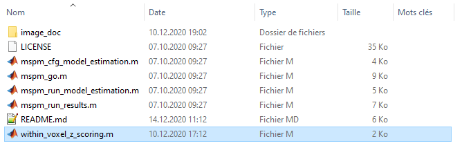
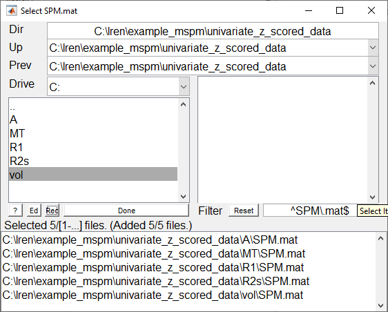
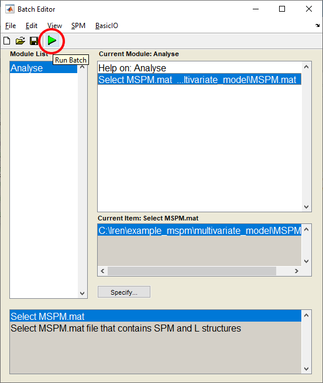

# Step by Step guide for the MSPM toolbox

# Preparation of the data

It is strongly adviced to apply z-scoring to your data before the analysis so that the weight of the canonical vectors are interpretable even though the multiple modalities used in the multivariate analysis are not of the same scale. The z-scoring should be applied within each modality and within each voxel. This step can be performed using the function _within_voxel_z_scoring.m_ found in the main folder of the MSPM toolbox. __It is very important that the mask you use to constrain the space where the z-scoring is performed__ (second argument of *within_voxel_z_scoring.m* function) __is then used as explicit mask for the univariate models__.

# Univariate models

The first step to use the classical interface of SPM12 to estimate one univariate model for each of the modality you would like to input in the multivariate model. It is crucial that the univariate models have the exact same design matrix X, the design matrix you are interested to test in the multivariate model.

# Set path MSPM toolbox
- Add the MSPM toolbox to you matlab path

# Multivariate model estimation

This section describes how to estimate the multivariate model.

- Open a SPM batch and select _SPM >> Tools >> MSPM >> Model estimation_

- Input the _SPM.mat_ files from the univariate analyses in the batch

- Select the output directory

- Run batch to estimate the model

- In the output directory you defined just above, there is now a _MSPM.mat_ file.

# Testing hypotheses on the multivariate model

This section describes how to test hypotheses on the multivariate model. This essentially reduces to define L contrasts on the data matrix and c contrasts on the design  matrix.

- Open a SPM batch and select _SPM >> Tools >> MSPM >> Analyse_

- select the _MSPM.mat_ file produced by the the previous step

- Run batch to open interface to input L and c contrasts

- To enter a new L contrast on the **data matrix**, press "New contrast" in the Panel L contrast

- Enter your matrix of contrast (in this example the matrix eye(5) was entered to test an hypothesis on all the modalities of the data matrix Y)

- To enter a new c contrast on the **design matrix**, press "New contrast" in the Panel c contrast. Note that you can enter a new contrast (or select a pre-existing contrast) only if a L contrast is selected on the left panel.

- Enter your matrix of contrast (_Note: wether you enter a t- or an F- contrast, the toolbox will always treat it as an F contrast and the output will be a F-map. So to avoid confusion, make sure to always use F-contrast._)

- The output of the specific combination of L and c contrast you just entered above is now in a newly created folder in the exact same path where the MSPM.mat file is. Note that the folder name L_XX_cYY is composed accordingly to the list of L and c contrast you have created (XX = number of the L contrast, YY = number of the c contrast).

# Visualize results

This section describes how to visualize the statistical map of a specific combination of L and c contrasts and how to visualize the canonical vectors.

## Visualize statistical F-map

- The statistical map of a specific combination of L and c contrasts can be simply visualized by using the Results button of SPM12 Menu

- Input the SPM.mat file contained in the L_XX_cYY folder of your interest

- Select the corresponding c contrast 

## Visualize canonical vectors

- To visualize canonical vectors simply use the _Check Registration_ function of SPM12 Menu. You can also add the statistical map to locate global and local maximum.

- The name of the canonical vector image contains information about which column (X) of the data matrix the canonical vector is related (depVar_X)

- use _Right-click >> Display >> Intensites_ to display the numerical value of the canonical vectors

